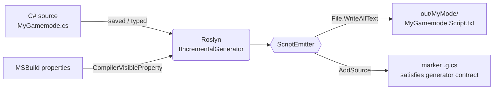

# ManiaScriptSharp

Write **C#** in your IDE, get **ManiaScript** `.Script.txt` files on disk in real time.

The project ships as a Roslyn incremental source generator plus a runtime/attributes library and a stub API surface. Every time you save (or even type) a C# file, the generator re-runs inside the IDE, re-translates your code, and overwrites the matching `.Script.txt` next to your project.

### 4 reasons why ManiaScriptSharp exists

1. Easier syntax
2. Accurate auto-complete
3. Reduced code bloat
4. Unit-testability

## How it works



1. The generator's `SyntaxProvider` watches every `ClassDeclarationSyntax` whose base list references [`IContext`](src/ManiaScriptSharp/IContext.cs).
2. For each match, [`ScriptEmitter`](src/ManiaScriptSharp.Generator/ScriptEmitter.cs) walks the syntax tree with a `SemanticModel` and produces ManiaScript text following the C# to ManiaScript conversion reference below.
3. [`BuildSettings`](src/ManiaScriptSharp.Generator/BuildSettings.cs) reads compiler-visible MSBuild properties to set the output folder and indentation. Configure them in your `.csproj`:

     ```xml
     <PropertyGroup>
         <ManiaScriptOutputDir>out</ManiaScriptOutputDir>
         <ManiaScriptIndentSize>4</ManiaScriptIndentSize>
         <ManiaScriptIndentStyle>spaces</ManiaScriptIndentStyle>
     </PropertyGroup>
     ```

     `ManiaScriptOutputDir` defaults to `out`; indentation defaults to tabs.
4. The emitted text is written via `File.WriteAllText`, and a tiny marker `// generated` C# file is added through `SourceProductionContext.AddSource` so the generator participates in the compilation legitimately.

Writes are skipped when the existing file is byte-identical, so IDE responsiveness stays smooth.

## Quick start

```powershell
dotnet build samples/MyMode/MyMode.csproj
```

After building (or just opening `samples/MyMode/MyGamemode.cs` in Visual Studio / VS Code with the C# extension), look at:

```
samples/MyMode/out/MyMode/MyGamemode.Script.txt
```

Edit the C# file, save, and the `.Script.txt` is rewritten automatically.

### Extending the generator

- Add a new type mapping in [TypeMapper.cs](src/ManiaScriptSharp.Generator/TypeMapper.cs).
- Add a new statement/expression in [ScriptEmitter.cs](src/ManiaScriptSharp.Generator/ScriptEmitter.cs).
- Add new diagnostics in [Diagnostics.cs](src/ManiaScriptSharp.Generator/Diagnostics.cs).

---

## Table of Contents

1. [Type Mappings](#type-mappings)
2. [Variables](#variables)
3. [Constants](#constants)
4. [Settings](#settings)
5. [Operators](#operators)
6. [String Handling](#string-handling)
7. [Control Flow](#control-flow)
8. [Functions](#functions)
9. [Collections (Lists & Arrays)](#collections-lists--arrays)
10. [LINQ Queries](#linq-queries)
11. [Structs](#structs)
12. [Vectors](#vectors)
13. [Classes and Aliases](#classes-and-aliases)
14. [Contexts](#contexts)
15. [Inheritance (RequireContext & Extends)](#inheritance-requirecontext--extends)
16. [Library Inclusions](#library-inclusions)
17. [Labels](#labels)
18. [Timing Instructions](#timing-instructions)
19. [Event Handling](#event-handling)
20. [Manialink Bindings](#manialink-bindings)
21. [Netwrites & Netreads](#netwrites--netreads)
22. [Persistent Variables](#persistent-variables)
23. [Pattern Matching](#pattern-matching)
24. [Log & Assertions](#log--assertions)
25. [Game Mode Structure](#game-mode-structure)
26. [Quick Reference Table](#quick-reference-table)

---

## Type Mappings

### Primitive Types

| C# | ManiaScript | Notes |
|---|---|---|
| `void` | `Void` | Function return type only |
| `int` | `Integer` | Range: -2147483648 to 2147483647 |
| `float` | `Real` | Floating-point; ManiaScript uses trailing dot (`99.`) |
| `double` | `Real` | Same as `float` in ManiaScript |
| `bool` | `Boolean` | `true`/`false` → `True`/`False` |
| `string` | `Text` | Double-quoted strings |

### Collection Types

| C# | ManiaScript | Notes |
|---|---|---|
| `IList<int>` | `Integer[]` | Ordered list |
| `ImmutableArray<int>` | `Integer[]` | Same as list (will change) |
| `List<string>` | `Text[]` | Ordered list |
| `Dictionary<string, int>` | `Integer[Text]` | Associative array |
| `Dictionary<int, string>` | `Text[Integer]` | Associative array |

### Vector Types

| C# | ManiaScript | Notes |
|---|---|---|
| `Vector2` / custom | `Vec2` | `<Real, Real>` |
| `Vector3` / custom | `Vec3` | `<Real, Real, Real>` |
| custom `Int3` | `Int3` | `<Integer, Integer, Integer>` |

### Special Types

| C# | ManiaScript | Notes |
|---|---|---|
| `Ident` (custom) | `Ident` | Object identifier |
| `null` | `Null` | For class references |
| `NullId` (custom) | `NullId` | For Ident values |

### Boolean Literals

| C# | ManiaScript |
|---|---|
| `true` | `True` |
| `false` | `False` |

---

## Variables

### Local Variables

C#:
```cs
string name;                  // declaration with type
int count = 42;               // declaration with initializer
var inferred = "hello";       // type inferred
```
ManiaScript:
```
declare Text name;
declare Integer count = 42;
declare inferred = "hello";
```

### Global Variables

Public fields become globals with `G_` prefix.

C#:
```cs
public int PreviousTime = -1;
public string ServerName;
```
ManiaScript:
```
declare Integer G_PreviousTime;
declare Text G_ServerName;

main() {
  G_PreviousTime = -1;
}
```

> For library scripts, inline field initialization is not supported at all.

### Extension Variables (`for` keyword)

C#:
```cs
// Attach a variable to an existing object
[For(nameof(LocalUser))]
public string SomeVar;

[For(nameof(LocalUser), Default = 42)]
public int SomeOtherVar;
```
ManiaScript:
```
declare Text SomeVar for LocalUser;
declare Integer SomeOtherVar for LocalUser = 42;
```

### Variable Aliasing

When two objects of the same type share a variable name:

C#:
```cs
[For("Players[0]", Alias = "CustomScore1")]
public int CustomScore;

[For("Players[1]", Alias = "CustomScore2")]
public int CustomScore;
```
ManiaScript:
```
declare Integer CustomScore for Players[0] as CustomScore1;
declare Integer CustomScore for Players[1] as CustomScore2;
```

---

## Constants

C#:
```cs
const int MaxPlayers = 16;
const string ScriptVersion = "1.2";
const bool EnableDebug = false;
```
ManiaScript:
```
#Const C_MaxPlayers 16
#Const C_ScriptVersion "1.2"
#Const C_EnableDebug False
```

---

## Settings

Settings are decorated using the `SettingAttribute`. They can be constants or read-only fields.

C#:
```cs
[Setting]
const string AdminLogin = "bigbang1112";

[Setting(As = "Chat time")]
const int ChatTime = 50;

[Setting(As = "<hidden>")]
const int HiddenSetting = 25;

[Setting(Translated = false)]
const int PointLimit = 25;
```
ManiaScript:
```
#Setting S_AdminLogin "bigbang1112"
#Setting S_ChatTime 50 as _("Chat time")
#Setting S_HiddenSetting 25 as "<hidden>"
#Setting S_PointLimit 25
```

### Setting Change Detection

Add `SettingsChangeDetectorsAttribute` on your class:

```cs
[SettingsChangeDetectors]
public class MyMode : CTmMode, IContext
{
    [Setting(ReloadOnChange = true)]
    const int TimeLimit = 600;

    [Setting(CallOnChange = nameof(OnChatTimeChanged))]
    const int ChatTime = 50;

    public bool Reload;

    public virtual void Settings() { }
    public virtual void UpdateSettings() { }

    private void OnChatTimeChanged() { /* handle change */ }
}
```

---

## Operators

All basic operators are supported.

Mixing `int` and `float` produces `Real` in ManiaScript.

### Ternary (`?:`) and `??=`

ManiaScript has **no inline conditional operator**. `a ? b : c` and `a ??= b` are only
translated when they are the *entire* value of a local declaration, assignment, or
`return` statement — the generator rewrites them into an `if`/`else` statement:

| C# | ManiaScript |
|---|---|
| `int y = x > 0 ? 1 : -1;` | `declare Integer Y;`<br>`if (X > 0) { Y = 1; } else { Y = -1; }` |
| `return x > 0 ? 1 : -1;` | `if (X > 0) { return 1; } else { return -1; }` |
| `x ??= 1;` | `if (X == Null) { X = 1; }` |

Using `?:` or `??=` anywhere else (e.g. nested inside another expression or as a call
argument) cannot be expressed in ManiaScript and is reported as an unsupported construct
(`MSS003`) — extract it into its own statement first.

---

## String Handling

### Concatenation

ManiaScript uses `^` for string concatenation. C# string concatenation and interpolation map to this:

C#:
```cs
string result = "Hello " + "world!";
string greeting = name + " has " + score + " points.";
```
ManiaScript:
```
declare Text result = "Hello " ^ "world!";
declare Text greeting = name ^ " has " ^ score ^ " points.";
```

### String Interpolation → Triple-Quote Expressions

C#:
```cs
string msg = $"Hello {playerName}, score = {2 + 3}";
```
ManiaScript:
```
declare Text msg = """Hello {{{playerName}}}, score = {{{2 + 3}}}""";
```

### Verbatim / Raw Strings → Triple-Quoted Text

C#:
```cs
string raw = @"no need to escape ""quotes"" or paths\here";
```
ManiaScript:
```
declare Text raw = """no need to escape "quotes" or paths\here""";
```

### Escape Sequences

| C# | ManiaScript |
|---|---|
| `"\n"` | `"\n"` |
| `"\\"` | `"\\"` |
| `"\""` | Not needed in `"""..."""` |

### `ToString()` on Numbers/Booleans

Calling `.ToString()` on a numeric or `bool` value converts to `Text` via ManiaScript's
auto-coercing `^` operator instead of a `TextLib` call:

C#:
```cs
string s = score.ToString();
```
ManiaScript:
```
declare Text S = "" ^ Score;
```

### Automatic `string` Method Mapping (TextLib)

Common `System.String` instance/static methods and `int.Parse`/`float.Parse` translate
directly to `TextLib::` calls — no explicit `TextLib.Method(...)` call is required:

| C# | ManiaScript |
|---|---|
| `s.Length` | `TextLib::Length(s)` |
| `s.ToUpper()` / `ToUpperInvariant()` | `TextLib::ToUpperCase(s)` |
| `s.ToLower()` / `ToLowerInvariant()` | `TextLib::ToLowerCase(s)` |
| `s.Trim()` | `TextLib::Trim(s)` |
| `s.Substring(start, len)` | `TextLib::SubString(s, start, len)` |
| `s.Substring(start)` | `TextLib::SubString(s, start, TextLib::Length(s))` |
| `s.Contains(v)` | `TextLib::Find(v, s, True, True)` |
| `s.StartsWith(v)` / `EndsWith(v)` | `TextLib::StartsWith(v, s)` / `TextLib::EndsWith(v, s)` |
| `s.Replace(old, new)` | `TextLib::Replace(s, old, new)` |
| `s.Split(sep)` | `TextLib::Split(sep, s)` |
| `string.Join(sep, items)` | `TextLib::Join(sep, items)` |
| `string.IsNullOrEmpty(s)` / `IsNullOrWhiteSpace(s)` | `s == ""` |
| `string.Concat(a, b, ...)` | `a ^ b ^ ...` |
| `int.Parse(s)` | `TextLib::ToInteger(s)` |
| `float.Parse(s)` | `TextLib::ToReal(s)` |

> These calls emit a bare `TextLib::` reference; ManiaScript still requires `#Include
> "TextLib" as TextLib` for it to resolve. Declare a field of the built-in `TextLib` type
> named `TextLib` somewhere in the class (see [Library Inclusions](#library-inclusions))
> so the include directive is generated — otherwise the script won't compile.

---

## Control Flow

### If / Else If / Else

C#:
```cs
if (list.Count > 2)
{
    DoSomething(list);
}
else if (list.Count == 0)
{
    Log("Empty");
}
else
{
    Log("Too few items");
}
```
ManiaScript:
```
if (list.count > 2) {
    DoSomething(list);
} else if (list.count == 0) {
    log("Empty");
} else {
    log("Too few items");
}
```

### Switch Statement

C#:
```cs
switch (block.Direction)
{
    case CBlock.CardinalDirections.North:
        Log("North");
        break;
    case CBlock.CardinalDirections.South:
        Log("South");
        break;
    default:
        Log("Other");
        break;
}
```
ManiaScript:
```
switch (Block.Direction) {
    case CBlock::CardinalDirections::North: {
        log("North");
    }
    case CBlock::CardinalDirections::South: {
        log("South");
    }
    default: {
        log("Other");
    }
}
```

> Note: ManiaScript uses `::` for enum/class member access, C# uses `.`.

### Switchtype (Type Checking)

`switchtype` is only emitted for an actual C# `switch` statement whose case labels are
type patterns. An `if`/`else if` chain using `is T t` stays an `if`/`else if` chain (see
[Pattern Matching](#pattern-matching)) — it is never rewritten into `switchtype`.

C#:
```cs
switch (control)
{
    case CMlEntry entry:
        Log(entry.Value);
        break;
    case CMlTextEdit textEdit:
        Log(textEdit.Value);
        break;
    default:
        Log("not an input element");
        break;
}
```
ManiaScript:
```
switchtype (Control) {
    case CMlEntry: {
        declare Entry = (Control as CMlEntry);
        log(Entry.Value);
    }
    case CMlTextEdit: {
        declare TextEdit = (Control as CMlTextEdit);
        log(TextEdit.Value);
    }
    default: {
        log("not an input element");
    }
}
```

### While Loop

C#:
```cs
int itemCount = 10;
while (itemCount > 0)
{
    itemCount -= 1;
}
```
ManiaScript:
```
declare Integer ItemCount = 10;
while (ItemCount > 0) {
    ItemCount -= 1;
}
```

### For Loop

C#:
```cs
for (int i = 2; i <= 5; i++)
{
    Log(i.ToString());
}
```
ManiaScript:
```
for (I, 2, 5) {
    log("" ^ I);
}
```

ManiaScript's `for` only expresses one shape: `for (Var, Low, High)`, stepping by exactly 1
and including both bounds. The generator recognizes this shape — a single declared loop
variable, a condition comparing that *same* variable with `<` or `<=`, and an incrementor of
`i++`, `++i`, or `i += 1` — and rewrites it into `for (...)`. `<` bounds are translated as
`High - 1` since ManiaScript's upper bound is inclusive:

C#:
```cs
for (int i = 0; i < 10; i++)      // exclusive upper bound
{
    Log(i.ToString());
}

for (int i = 0; i < 10; ++i)      // pre-increment — same canonical shape
{
    Log(i.ToString());
}

for (int i = 0; i < 10; i += 1)   // += 1 — same canonical shape
{
    Log(i.ToString());
}
```
ManiaScript:
```
for (I, 0, 10 - 1) {
    log("" ^ I);
}

for (I, 0, 10 - 1) {
    log("" ^ I);
}

for (I, 0, 10 - 1) {
    log("" ^ I);
}
```

#### Falling Back to `while`

Every shape ManiaScript's `for` *can't* express — decrementing, a step other than 1, a
non-integer counter, a condition on a different variable, a loop variable declared outside
the loop, or an omitted condition — is rewritten as an equivalent `while` loop instead of
being forced into (or silently misinterpreted as) `for (...)`:

C#:
```cs
// Descending
for (int i = 10; i > 0; i--)
{
    Log(i.ToString());
}
```
ManiaScript:
```
declare Integer I = 10;
while (I > 0) {
    log("" ^ I);
    I -= 1;
}
```

C#:
```cs
// Custom step
for (int i = 0; i < 10; i += 2)
{
    Log(i.ToString());
}
```
ManiaScript:
```
declare Integer I = 0;
while (I < 10) {
    log("" ^ I);
    I += 2;
}
```

C#:
```cs
// Non-integer counter
for (float f = 0f; f < 1f; f += 0.5f)
{
    Log(f.ToString());
}
```
ManiaScript:
```
declare Real F = 0.;
while (F < 1.) {
    log("" ^ F);
    F += 0.5;
}
```

C#:
```cs
// Loop variable declared outside — reused, not redeclared
int i;
for (i = 0; i < 10; i++)
{
    Log(i.ToString());
}
```
ManiaScript:
```
declare Integer I;
I = 0;
while (I < 10) {
    log("" ^ I);
    I += 1;
}
```

C#:
```cs
// Omitted condition — infinite loop, exited via break
for (int i = 0; ; i++)
{
    if (i >= 10) break;
    Log(i.ToString());
}
```
ManiaScript:
```
declare Integer I = 0;
while (True) {
    if (I >= 10) break;
    log("" ^ I);
    I += 1;
}
```

> Multiple declared loop variables (`for (int i = 0, j = 10; ...; ...)`) also fall back to
> `while`, since ManiaScript's `for` only has room for a single counter.

### Foreach Loop

C#:
```cs
foreach (var item in myList)
{
    Log(item);
}
```
ManiaScript:
```
foreach (Item in MyList) {
    log(Item);
}
```

With index/key:
C#:
```cs
foreach (var (index, item) in myArray)
{
    Log($"{index}: {item}");
}
```
ManiaScript:
```
foreach (Index => Item in MyArray) {
    log(Index ^ ": " ^ Item);
}
```

`.Index()` (System.Linq) works on any list, not just plain ordered arrays, so it can't reuse
the native key — it desugars into a manually incremented counter instead:

C#:
```cs
foreach (var (index, item) in myArray.Index())
{
    Log($"{index}: {item}");
}
```
ManiaScript:
```
declare Integer Index = 0;
foreach (Item in MyArray) {
    log(Index ^ ": " ^ Item);
    Index += 1;
}
```

### Break and Continue

C#:
```cs
foreach (var control in Page.MainFrame.Controls)
{
    if (control is not CMlLabel)
        continue;

    var label = (CMlLabel)control;
    if (label.Value == "match")
    {
        match = label;
        break;
    }
}
```
ManiaScript:
```
foreach (Control in Page.MainFrame.Controls) {
    if (!(Control is CMlLabel))
        continue;
    declare Label = (Control as CMlLabel);
    if (Label.Value == "match") {
        Match = Label;
        break;
    }
}
```

---

## Functions

### Basic Function Definition

C#:
```cs
int Minimum(int a, int b)
{
    if (a < b) return a;
    return b;
}
```
ManiaScript:
```
Integer Minimum(Integer _A, Integer _B) {
    if (_A < _B) return _A;
    return _B;
}
```

### Conventions Applied Automatically

| C# Convention | ManiaScript Output |
|---|---|
| `private` method | `Private_` prefix added |
| `public`/`internal` method | No prefix |
| Parameter `int time` | `Integer _Time` (PascalCase + underscore) |
| `static` keyword | Ignored (use for unit testing) |
| `virtual` keyword | Becomes a label |

### Void Functions

C#:
```cs
void DoNothing()
{
}
```
ManiaScript:
```
Void DoNothing() {
}
```

### Private Functions

C#:
```cs
private static string TimeToTextWithMilli(int time)
{
    return $"{TextLib.TimeToText(time, true)}{MathLib.Abs(time % 10)}";
}
```
ManiaScript:
```
Text Private_TimeToTextWithMilli(Integer _Time) {
    return TextLib::TimeToText(_Time, True) ^ MathLib::Abs(_Time % 10);
}
```

### Function Overloading (Polymorphism)

ManiaScript supports overloading by argument types:

C#:
```cs
int Sum(int a, int b) => a + b;
float Sum(float a, float b) => a + b;
```
ManiaScript:
```
Integer Sum(Integer _A, Integer _B) { return _A + _B; }
Real Sum(Real _A, Real _B) { return _A + _B; }
```

### Optional Parameters (Simulated)

ManiaScript does not have default parameters, but overloading provides the same pattern:

C#:
```cs
void DoSomething(CMlControl control, bool flag = true)
{
    // ...
}
```
ManiaScript:
```
Void DoSomething(CMlControl _Control, Boolean _Flag) { /* ... */ }
Void DoSomething(CMlControl _Control) {
    DoSomething(_Control, True);
}
```

> The most generic overload must be declared first in ManiaScript.

### Named Arguments

C# named arguments are preserved as inline comments, since ManiaScript has no equivalent syntax:

C#:
```cs
DoSomething(enabled: true, count: 5);
```
ManiaScript:
```
DoSomething(/* enabled: */ True, /* count: */ 5);
```

### Properties (Get/Set Functions)

Properties with accessor bodies (or auto-properties) become `Get`/`Set` functions, since
ManiaScript has no property syntax. Reading the property calls the getter; assigning to it
calls the setter.

C#:
```cs
public int Score { get; set; }              // auto-property

public int Doubled => Score * 2;            // expression-bodied getter

private int _x;
public int Custom
{
    get { return _x; }
    set { _x = value / 2; }
}
```
ManiaScript:
```
declare Integer G_Score;

Integer GetScore() { return G_Score; }
Void SetScore(Integer _Value) { G_Score = _Value; }

Integer GetDoubled() { return G_Score * 2; }

Integer GetCustom() { return X; }
Void SetCustom(Integer _Value) { X = _Value / 2; }
```

> Auto-properties get a backing global (`G_` prefix if public); properties with a custom
> body do not — the body decides what to read/write. `private` properties get
> `Private_Get`/`Private_Set` prefixes, same as private methods.

### The `main()` Function

The `Main()` method in `IContext` generates `main()`. If simple enough, the entire script can omit the function header.

## Collections (Lists & Arrays)

### Lists

C#:
```cs
List<string> myList = new() { "Alpha", "Beta", "Gamma" };

// Access
var first = myList[0];
var size = myList.Count;

// Mutate
myList.Add("Omega");
myList.RemoveAt(0);
myList.Remove("Beta");
myList.Clear();

// Query
bool exists = myList.Contains("Gamma");
int idx = myList.IndexOf("Alpha");

// Sort
myList.Sort();
```
ManiaScript:
```
declare Text[] MyList = ["Alpha", "Beta", "Gamma"];

// Access
declare First = MyList[0];
declare Size = MyList.count;

// Mutate
MyList.add("Omega");
MyList.removekey(0);
MyList.remove("Beta");
MyList.clear();

// Query
declare Exists = MyList.exists("Gamma");
declare Idx = MyList.keyof("Alpha");

// Sort
declare SortedList = MyList.sort();
```

#### Full List API Mapping

| C# | ManiaScript |
|---|---|
| `.Count` | `.count` |
| `.Add(value)` | `.add(value)` |
| `.Insert(0, value)` | `.addfirst(value)` |
| `.RemoveAt(index)` | `.removekey(index)` |
| `.Remove(value)` | `.remove(value)` |
| `.Clear()` | `.clear()` |
| `.Contains(value)` | `.exists(value)` |
| `.IndexOf(value)` | `.keyof(value)` |
| `index >= 0 && index < list.Count` | `.existskey(index)` |
| `.Sort()` / `.OrderBy()` | `.sort()` |
| `.Reverse()` / `.OrderByDescending()` | `.sortreverse()` |
| JSON serialize | `.tojson()` |
| JSON deserialize | `.fromjson(json)` |

### Associative Arrays (Dictionaries)

C#:
```cs
var scores = new Dictionary<string, float>
{
    ["Pi"] = 3.14f,
    ["Tau"] = 6.28f
};

scores["Leet"] = 13.37f;
var pi = scores["Pi"];
```
ManiaScript:
```
declare Real[Text] Scores = ["Pi" => 3.14, "Tau" => 6.28];

Scores["Leet"] = 13.37;
declare Pi = Scores["Pi"];
```

`TryGetValue` (in an `if`/`if (!...)` condition) is translated using `.existskey()` plus an indexer read, since ManiaScript has no out-parameter equivalent:

C#:
```cs
if (scores.TryGetValue("Pi", out var pi)) { /* use pi */ }
if (!scores.TryGetValue("Pi", out var pi)) { return; } // use pi below
```
ManiaScript:
```
if (Scores.existskey("Pi")) {
    declare Real Pi = Scores["Pi"];
    /* use Pi */
}
declare Real Pi;
if (!Scores.existskey("Pi")) {
    return;
} else {
    Pi = Scores["Pi"];
}
// use Pi below
```

### Nested Collections

C#:
```cs
var usersData = new List<Dictionary<string, string>>
{
    new() { ["login"] = "me", ["name"] = "still me" },
    new() { ["login"] = "you", ["name"] = "still you" }
};
var login = usersData[0]["login"];
```
ManiaScript:
```
declare Text[Text][] UsersData = [
    ["login" => "me", "name" => "still me"],
    ["login" => "you", "name" => "still you"]
];
declare Login = UsersData[0]["login"];
```

### Collection Expressions (C# 12)

C# collection expression syntax (`[...]`) produces the same array/list literal:

C#:
```cs
int[] nums = [1, 2, 3, 4, 5];
int[] empty = [];
```
ManiaScript:
```
declare Integer[] Nums = [1, 2, 3, 4, 5];
declare Integer[] Empty = [];
```

## LINQ Queries

LINQ chains on local variables are desugared into `foreach` loops at compile time — see
[linq-translation.md](docs/linq-translation.md) for the full reference (every supported stage
and terminal, composition rules, and partially-supported patterns like `GroupBy`/`Zip`).

C#:
```cs
var result = nums.Where(x => x > 0).Select(x => x * 2).ToList();
var cnt = nums.Where(x => x > 5).Count();
```
ManiaScript:
```
declare Integer[] Result;
foreach (X in Nums) {
    if (X > 0) {
        Result.add(X * 2);
    }
}

declare Integer Cnt = 0;
foreach (X in Nums) {
    if (X > 5) {
        Cnt += 1;
    }
}
```

> **Diagnostic MSS008** is reported when a chain has no terminal call (`.ToList()`,
> `.Count()`, `.First()`, …) to materialise it, or when a method has no ManiaScript
> equivalent.

## Structs

ManiaScript `#Struct` maps to C# structs or classes with a special attribute:

C#:
```cs
public struct MyStruct
{
    public int MyMember;
    public string MyTextMember;
}

// Usage
var myVar = new MyStruct();
Log(myVar.MyMember.ToString());    // 0

myVar.MyMember = 1;
var copy = myVar;                  // value copy
myVar.MyMember = 2;
Log(copy.MyMember.ToString());     // still 1
```
ManiaScript:
```
#Struct MyStruct {
    Integer MyMember;
    Text MyTextMember;
}

main() {
    declare MyStruct MyVar;
    log("" ^ MyVar.MyMember); // 0

    MyVar.MyMember = 1;
    declare MyStruct MyCopy = MyVar;
    MyVar.MyMember = 2;
    log("" ^ MyCopy.MyMember); // 1
}
```

## Vectors

C#:
```cs
var v2 = new Vec2(1.0f, 2.0f);
var v3 = new Vec3(1.0f, 2.0f, 3.0f);
var i3 = new Int3(0, 255, 0);

// Access components
float x = v3.X;
float y = v3.Y;
float z = v3.Z;
// or by index
float first = v3[0];
```
ManiaScript:
```
declare Vec2 V2 = <1.0, 2.0>;
declare Vec3 V3 = <1.0, 2.0, 3.0>;
declare Int3 I3 = <0, 255, 0>;

// Access components
declare Real X = V3.X;
declare Real Y = V3.Y;
declare Real Z = V3.Z;
// or by index
declare Real First = V3[0];
```

### Null Checks

C#:
```cs
if (player == null)
{
    Log("No player");
}
```
ManiaScript:
```
if (Player == Null) {
    log("No player");
}
```

### Id Comparison

C#:
```cs
var playerId = Players[0].Id;  // Store Ident
// Later...
var player = Players[playerId]; // Retrieve by Id
```
ManiaScript:
```
declare PlayerId = Players[0].Id;
// Later...
declare Player <=> Players[PlayerId];
```

## Contexts

`IContext` generates ManiaScript code from `Main()` (runs once) and `Loop()` (wrapped in `while(True) { yield; ... }`).

ManiaScript only requires a `main()` entry point when the script also declares other functions — bare top-level statements aren't allowed alongside function definitions. So when the class defines nothing besides `Main()`/`Loop()`, the code is emitted directly at the top level, with no `main()` wrapper:

C#:
```cs
public class MyMode : CTmMode, IContext
{
    public void Main()
    {
        // Runs once at start
    }

    public void Loop()
    {
        // Runs every frame inside while(True) { yield; ... }
    }
}
```
ManiaScript:
```
#RequireContext CTmMode

// Main() contents here

while (True) {
    yield;
    // Loop() contents here
}
```

Once the class declares any other function, the generator wraps `Main()`/`Loop()` in `main()` so ManiaScript accepts the file:

C#:
```cs
public class MyMode : CTmMode, IContext
{
    public void Main()
    {
        Setup();
    }

    public void Loop()
    {
        // Runs every frame inside while(True) { yield; ... }
    }

    void Setup() { }
}
```
ManiaScript:
```
#RequireContext CTmMode

Void Setup() {
}

main() {
    Setup();

    while (True) {
        yield;
    }
}
```

### One-off Scripts (`NoLoopAttribute`)

Add `NoLoopAttribute` on your class to suppress the generated `while(True) { yield; ... }` wrapper entirely. `Loop()` is never emitted, even if it has a body — useful for scripts that only need `Main()` to run once and then end.

C#:
```cs
[NoLoop]
public class MyOneOffScript : CTmMode, IContext
{
    public void Main()
    {
        // Runs once, script then ends — no while(True) loop is generated
    }

    public void Loop()
    {
        // Never emitted
    }
}
```
ManiaScript:
```
#RequireContext CTmMode

// Main() contents here
```

## Inheritance (RequireContext & Extends)

### API Class → `#RequireContext`

C#:
```cs
public class MyMode : CTmMode, IContext { }
```
ManiaScript:
```
#RequireContext CTmMode
```

### Custom Class → `#Extends`

The namespace becomes the directory path, class name becomes the file name:

C#:
```cs
namespace Modes.TrackMania;

public class MyNextMode : MyMode { }
```
ManiaScript:
```
#Extends "Modes/TrackMania/MyMode.Script.txt"
```

## Library Inclusions

### Standard Libraries (hardcoded)

C#:
```cs
// Using TextLib, MathLib, TimeLib, AnimLib, MapUnits is automatic
var number = TextLib.ToInteger("1");
var abs = MathLib.Abs(-5);
```
ManiaScript:
```
#Include "TextLib" as TextLib
#Include "MathLib" as MathLib

declare Number = TextLib::ToInteger("1");
declare Abs = MathLib::Abs(-5);
```

### Automatic Math Mapping (`System.Math` / `MathF`)

`System.Math`/`System.MathF` calls also translate directly to `MathLib::` — no explicit
`MathLib.Method(...)` call is required (same caveat as `TextLib` above: a `MathLib` field
must exist for `#Include "MathLib" as MathLib` to be emitted):

| C# | ManiaScript |
|---|---|
| `Math.Abs/Sin/Cos/Tan/Asin/Acos(x)` | `MathLib::Abs/Sin/Cos/Tan/Asin/Acos(x)` |
| `Math.Atan(x)` | `MathLib::Atan2(x, 1.)` |
| `Math.Atan2(x, y)` | `MathLib::Atan2(x, y)` |
| `Math.Sqrt/Pow/Exp(x[, y])` | `MathLib::Sqrt/Pow/Exp(x[, y])` |
| `Math.Log(x)` | `MathLib::Ln(x)` |
| `Math.Log(x, b)` / `Log2(x)` / `Log10(x)` | `(MathLib::Ln(x) / MathLib::Ln(b))` |
| `Math.Floor/Ceiling/Round/Truncate(x)` | `MathLib::FloorInteger/CeilingInteger/NearestInteger/TruncInteger(x)` |
| `Math.Max/Min/Clamp(...)` | `MathLib::Max/Min/Clamp(...)` |
| `Math.Sign(x)` | `(x > 0 ? 1 : (x < 0 ? -1 : 0))` |
| `Math.Cosh/Sinh/Tanh(x)` | Expanded from `MathLib::Exp` |
| `Math.PI` | `MathLib::PI()` |
| `Math.E` | `MathLib::Exp(1.)` |
| `Math.Tau` | `(MathLib::PI() * 2.)` |

> `Math.Sign`/`Cosh`/`Sinh`/`Tanh` expand to inline ternary/exponential expressions since
> ManiaScript's `MathLib` has no direct equivalents.

### Custom Libraries

A custom library is a class implementing `ILib` (or `ILib<T>` when it needs the calling
context). Add it as a field on the consuming class — any public/internal field whose type
implements `ILib` is auto-`#Include`d, using the field name (PascalCase) as the alias:

C#:
```cs
public class MyMode : CTmMode, IContext
{
    public required Message Message;

    public void Main()
    {
        var version = Message.Version;
    }
}
```
ManiaScript:
```
#Include "Libs/Nadeo/Message.Script.txt" as Message

main() {
    declare Version = Message::Version;
}
```

> Note: C# uses `.` for member access on the lib field, ManiaScript uses `::` on the alias.
> The `[Include]` attribute only emits a raw `#Include` directive — it does not give you a
> callable/accessible member in C#. Use a lib-typed field for anything you actually call
> into from code.

## Labels

The closest C# feature to ManiaScript labels is virtual/override methods.

### Defining a Label (Virtual Method)

C#:
```cs
public class MyMode : CTmMode, IContext
{
    public virtual void OnMapIntroEnd()
    {
        UIManager.UIAll.UISequence = CUIConfig.EUISequence.Playing;
    }

    public void Main()
    {
        OnMapIntroEnd();
    }

    public void Loop() { }
}
```
ManiaScript:
```
#RequireContext CTmMode

***OnMapIntroEnd***
***
UIManager.UIAll.UISequence = CUIConfig::EUISequence::Playing;
***

main() {
    +++OnMapIntroEnd+++
}
```

### Overriding a Label

C#:
```cs
public class MyNextMode : MyMode
{
    public override void OnMapIntroEnd()
    {
        Log("I do something");
    }
}
```
ManiaScript:
```
#Extends "Modes/TrackMania/MyMode.Script.txt"

***OnMapIntroEnd***
***
log("I do something");
***
```

> `base` calls are unused — ManiaScript always runs the inherited mode first.

### Label Types

| ManiaScript | Behavior |
|---|---|
| `+++ Label +++` | Can be extended multiple times |
| `--- Label ---` | Only the latest definition applies |

## Timing Instructions

### Yield

C#:
```cs
Yield(); // Pause for one frame
```
ManiaScript:
```
yield;
```

### Sleep

C#:
```cs
Sleep(1000); // Pause for 1000ms
```
ManiaScript:
```
sleep(1000);
```

### Wait

C#:
```cs
Wait(() => SomeCondition); // Pause until condition is true
```
ManiaScript:
```
wait(SomeCondition);
```

### Practical Pattern (timeout with early exit)

C#:
```cs
var start = Now;
Wait(() => Now > start + 1000);
```
ManiaScript:
```
declare Start = Now;
wait(Now > Start + 1000);
```

## Event Handling

Use C# event handlers to generate ManiaScript event loops:

C#:
```cs
public class MyManialink : CTmMlScriptIngame, IContext
{
    [ManialinkControl] public required CMlQuad QuadMapName;
    [ManialinkControl] public required CMlEntry EntryInput;

    public void Main()
    {
        QuadMapName.MouseClick += () =>
        {
            ShowCurChallengeCard();
        };

        EntryInput.EntrySubmit += (text) =>
        {
            Log(text);
        };
    }
}
```
ManiaScript:
```
declare CMlQuad QuadMapName;
declare CMlEntry EntryInput;

main() {
    QuadMapName = (Page.GetFirstChild("QuadMapName") as CMlQuad);
    EntryInput = (Page.GetFirstChild("EntryInput") as CMlEntry);

    while (True) {
        yield;
        foreach (Event in PendingEvents) {
            switch (Event.Type) {
                case CMlScriptEvent::Type::MouseClick: {
                    switch (Event.Control) {
                        case QuadMapName: {
                            ShowCurChallengeCard();
                        }
                    }
                }
                case CMlScriptEvent::Type::EntrySubmit: {
                    switch (Event.Control) {
                        case EntryInput: {
                            log(Event.CustomEventData[0]);
                        }
                    }
                }
            }
        }
    }
}
```

> Delegates, lambdas, and method references are all supported. Referencing a named method will call it rather than inlining contents. Subscriptions must be registered inside `Main()` — the generator only scans `Main()` for `+=` registrations.

## Manialink Bindings

Binding retrieves manialink elements by ID in a validated, strongly-typed way.

C#:
```cs
public class MyManialink : CTmMlScriptIngame, IContext
{
    [ManialinkControl]
    public required CMlLabel LabelCountdown;

    [ManialinkControl("CustomId")]
    public required CMlQuad SomeQuad;

    [ManialinkControl(IgnoreValidation = true)]
    public required CMlFrame DynamicFrame;
}
```
ManiaScript:
```
declare CMlLabel LabelCountdown;
declare CMlQuad SomeQuad;
declare CMlFrame DynamicFrame;

main() {
    LabelCountdown = (Page.GetFirstChild("LabelCountdown") as CMlLabel);
    SomeQuad = (Page.GetFirstChild("CustomId") as CMlQuad);
    DynamicFrame = (Page.GetFirstChild("DynamicFrame") as CMlFrame);
}
```

- If no ID is given on the attribute, the field name is used as the XML `id`.
- Set `IgnoreValidation = true` for dynamically-built manialinks.

## Netwrites & Netreads

Network-synchronized variables for communication between server and client scripts.

### Netwrite (server → client)

C#:
```cs
[Netwrite]
[For(nameof(player))]
public int NetScore;
```
ManiaScript:
```
declare netwrite Integer Net_NetScore for Player;
```

### Netread (client ← server)

C#:
```cs
[Netread]
[For(nameof(player))]
public int NetScore;
```
ManiaScript:
```
declare netread Integer Net_NetScore for Player;
```

## Persistent Variables

Variables that survive across script restarts (like cookies):

C#:
```cs
[Persistent]
[For(nameof(LocalUser))]
public string SavedSetting;
```
ManiaScript:
```
declare persistent Text Persistent_SavedSetting for LocalUser;
```

> Limited storage per object. Type cannot be changed once set — you must use a new name.

## Pattern Matching

ManiaScript's `is` keyword only tests — it does not bind a variable. Every C# pattern that introduces a variable therefore expands into an explicit `declare` cast. More complex C# patterns (`and`, `or`, `{ }`) have no direct equivalent and must be decomposed into separate `if` / `switch` blocks.

### `x is T` → type test

C#:
```cs
if (control is CMlLabel label)
{
    Log(label.Value);
}
```
ManiaScript:
```
if (Control is CMlLabel) {
    declare Label = (Control as CMlLabel);
    log(Label.Value);
}
```

### `x is not T` → negated type test

C#:
```cs
if (control is not CMlLabel)
    continue;
```
ManiaScript:
```
if (!(Control is CMlLabel))
    continue;
```

### `x is T { Prop: value }` → property pattern

C# property patterns have no equivalent in ManiaScript. They expand into a type check followed by a value check:

C#:
```cs
if (control is CMlLabel { Value: "target" })
{
    DoSomething();
}
```
ManiaScript:
```
if (Control is CMlLabel) {
    declare Label = (Control as CMlLabel);
    if (Label.Value == "target") {
        DoSomething();
    }
}
```

### `x is T t and condition` → `and` pattern

C# `and` inside `is` must be split into a type check block containing a separate condition:

C#:
```cs
if (control is CMlLabel label and { Value: not "" })
{
    Log(label.Value);
}
```
ManiaScript:
```
if (Control is CMlLabel) {
    declare Label = (Control as CMlLabel);
    if (Label.Value != "") {
        log(Label.Value);
    }
}
```

### `x is T1 or T2` → `or` pattern

C# `or` inside `is` expands into two separate `is` checks joined with `||`:

C#:
```cs
if (control is CMlEntry or CMlTextEdit)
{
    Log("input element");
}
```
ManiaScript:
```
if (Control is CMlEntry || Control is CMlTextEdit) {
    log("input element");
}
```

When the body needs the cast, use `switchtype` instead (see below).

### `switch(x) { case T: }` → `switchtype`

When branching on multiple types, C# type-switch patterns map to `switchtype`:

C#:
```cs
switch (control)
{
    case CMlEntry entry:
        Log(entry.Value);
        break;
    case CMlTextEdit edit:
        Log(edit.Value);
        break;
    default:
        Log("other");
        break;
}
```
ManiaScript:
```
switchtype (Control) {
    case CMlEntry: {
        declare Entry = (Control as CMlEntry);
        log(Entry.Value);
    }
    case CMlTextEdit: {
        declare Edit = (Control as CMlTextEdit);
        log(Edit.Value);
    }
    default: {
        log("other");
    }
}
```

For single-expression branches the cast can be inlined:

```
switchtype (Control) {
    case CMlEntry: log((Control as CMlEntry).Value);
    case CMlTextEdit: log((Control as CMlTextEdit).Value);
    default: log("other");
}
```

### Summary

| C# `is` pattern | ManiaScript translation |
|---|---|
| `x is T` | `X is T` |
| `x is T t` | `if (X is T) { declare t = (X as T); }` |
| `x is not T` | `!(X is T)` |
| `x is T { P: v }` | `if (X is T) { declare t = (X as T); if (t.P == v) { } }` |
| `x is T t and cond` | `if (X is T) { declare t = (X as T); if (cond) { } }` |
| `x is T1 or T2` | `X is T1 \|\| X is T2` |
| `switch(x) { case T t: }` | `switchtype (X) { case T: { declare t = (X as T); } }` |

## Log & Assertions

C#:
```cs
Log("Something went wrong!");       // prints to debug console (Ctrl+~)
Assert(myVariable == 3);            // halts script if false
```
ManiaScript:
```
log("Something went wrong!");
assert(MyVariable == 3);
```

`Console.Write`/`Console.WriteLine` are also mapped to `log(...)`, for code that's shared
with regular .NET tests:

C#:
```cs
Console.WriteLine(score);
```
ManiaScript:
```
log(Score);
```

## Quick Reference Table

| C# Feature | ManiaScript Equivalent |
|---|---|
| Class inheriting API class | `#RequireContext` |
| Class inheriting custom class | `#Extends "path.Script.txt"` |
| `IContext` interface | `main()` + `while(True) { yield; }` |
| `Main()` method | Code before `while` loop in `main()` |
| `Loop()` method | Code inside `while` loop |
| `const` field | `#Const C_Name` |
| `[Setting]` attribute | `#Setting S_Name` |
| `public` field | `declare G_Name` (global) |
| `private` method | `Private_FunctionName()` |
| Method parameters | PascalCased with `_` prefix |
| `virtual` method | Label (`***LabelName***`) |
| `override` method | Label extension |
| `[ManialinkControl]` field | `Page.GetFirstChild()` binding |
| Event handler (`+=`) | `foreach (Event in PendingEvents)` |
| String interpolation `$""` | Triple-quote `"""..{{{expr}}}..."""` |
| String concatenation `+` | `^` operator |
| `IList<T>` / `List<T>` | `T[]` list |
| `Dictionary<K,V>` | `V[K]` associative array |
| Namespace path | File path for `#Extends` |
| `.` member access on enums/classes | `::` in ManiaScript |
| `true` / `false` | `True` / `False` |
| `null` | `Null` |
| `is` type check | `is` / `switchtype` |
| Cast `(Type)x` | `(X as Type)` |
| `yield return` concept | `yield;` (pause 1 frame) |
| `Thread.Sleep(ms)` | `sleep(ms)` |
| `SpinWait.SpinUntil(cond)` | `wait(condition)` |
| `[Netwrite]` | `declare netwrite` |
| `[Netread]` | `declare netread` |
| `[Persistent]` | `declare persistent` |
| `struct` | `#Struct` |
| `Vector2` / `Vector3` | `Vec2` / `Vec3` |
| `for (i = a; i <= b; i++)` | `for (I, a, b)` |
| `foreach (x in list)` | `foreach (X in List)` |
| `foreach` with index | `foreach (Key => Val in Array)` |
| `break` | `break;` |
| `continue` | `continue;` |
| LINQ chain (`Where`/`Select`/...) | Desugared `foreach` loop (see [LINQ Queries](#linq-queries)) |
| Collection expression `[1, 2, 3]` | `[1, 2, 3]` |
| Named argument `f(x: 1)` | `f(/* x: */ 1)` |
| Auto-property / property with body | `Get`/`Set` functions |
| `x.ToString()` (numeric/bool) | `"" ^ x` |
| `Console.WriteLine(x)` / `Console.Write(x)` | `log(x)` |
| `Math.Abs(x)` etc. | `MathLib::Abs(x)` etc. (auto-mapped) |
| `s.ToUpper()`, `int.Parse(s)`, etc. | `TextLib::` calls (auto-mapped) |

## Conclusion

This project does not replace ManiaScript, nor text editor extensions that support ManiaScript. This is just an alternative way to be more productive in ManiaScript by using a language that you prefer more, which some may not agree with, and that is understandable. For code generation and unit testing though, this may not be the worst project. Just note that unit testing is just a theory that wasn't yet implemented.
